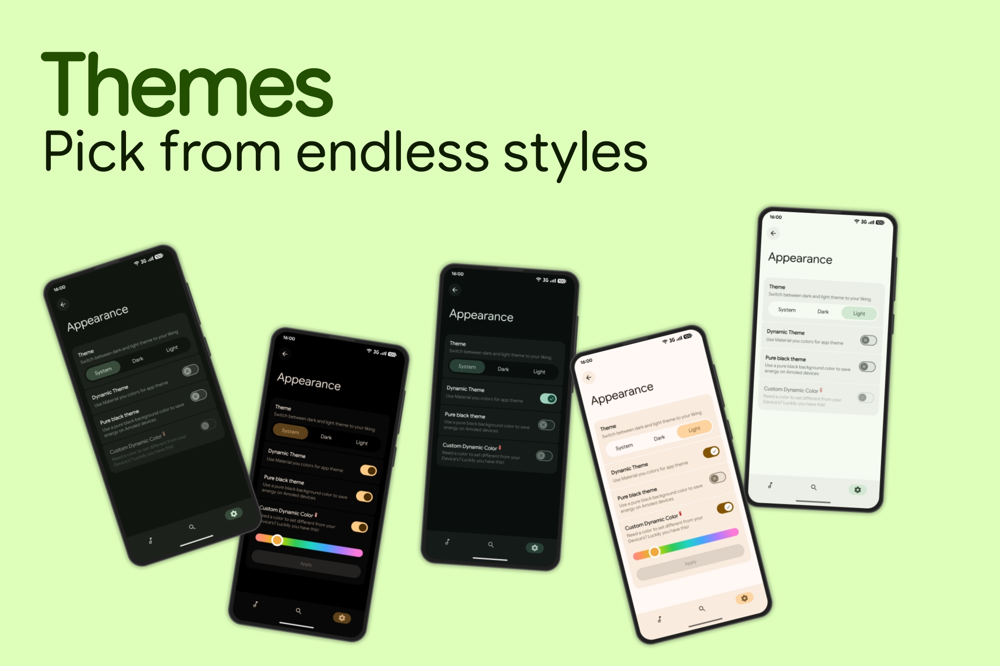
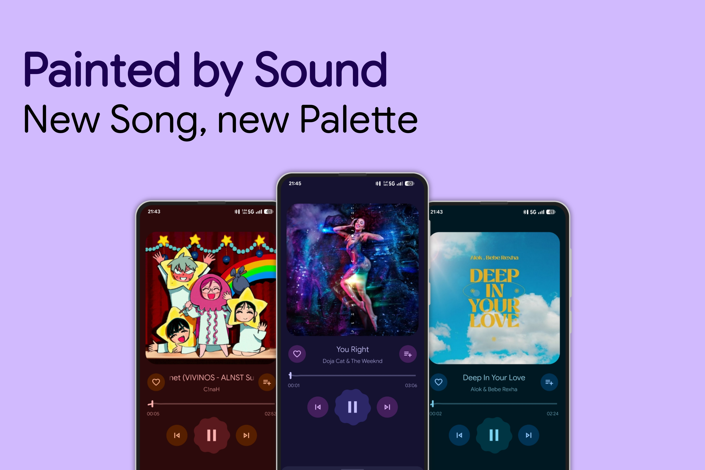

# 🎵 XMusic

##### A Material 3 Expressive Music player for Android built with pure Java

    

---

## ✨ Features (Detailed)
---
### Core Playback

- Media3 ExoPlayer based playback    
- Background playback with notification controls  
- MediaSession integration (lockscreen, headset, system controls)  

### Now Playing UI

- Dynamic Now Playing UI tinted by album artwork colors  
- Smooth track transitions and animated player states  
- Fullscreen Now Playing with expandable bottom sheet  
- Predictive back support with custom framework animations  

### UI & Animations

- MotionLayout-driven bottom sheet player  
- Gesture-based interactions  
- UI state restoration across configuration changes  
- Predictive back animations everywhere 

### Library & Browsing

- Local audio scanning with fast indexing  
- Song, album, and artist browsing  
- Instant queue building and reordering  
- Fully offline, on-device playback  

### Lyrics & Visuals

- Built-in lyrics support with animated transitions  
- Romaji/translation lyrics support

### Performance & Architecture
- Lightweight playback service 
- Works fine with low-end devices  

### Privacy

- No ads  
- No tracking  
- No “sign in to listen to your own files” clown behavior
- No cloud dependency  

### Customization

- Dynamic theming support  
- Album art–driven UI colors  

---

## To-Do List
- [ ] Finish settings screen
- [ ] Add more features to the now Playing UI
- [ ] Add a contextual menu for songs
- [ ] Make a functional search fragment 
- [ ] Idk
---

##  Showcase
---

---

## ⬇️ Download the app
- You can get Latest XMusic build via [GitHub Actions](https://github.com/Yamenher/XMusic/actions) or via the [dedicated topic](https://t.me/XMusicCommunity/4) in our telegram community.

---

## 📱 Minimum Requirements

- Android 8.0 (API 26) or higher
- Local audio files stored on device
- A brain (for reporting bugs)
---

## ⚠️ Important Notice
- The app is still WIP (Work In Progress) and is far away from a stable release, that's why you might notice a lot of bugs, missing features, and some instability problems, but **Don't worry,** everything will worked on in the near future.
---

## 🐛 Report bugs
If you run into bugs, crashes, or weird behavior that clearly wasn’t supposed to happen (looking at you, OEMs) :

- **GitHub Issues**  
  Report bugs, crashes, and feature requests [here](https://github.com/Yamenher/XMusic/issues)

- **Community & Discussion**  
  Join our telegram community for updates, feedback, and general discussion:  
  https://t.me/xmusiccommunity

Before opening an issue, make sure you’re on the latest nightly version, specify **The exact version you're using** via its commit hash from the APK file name and include logs, device info, and reproduction steps.
DO NOT JUST SAY "I'm using latest version"
Note : “App broken” is not a bug report.

---

## Q&A

**Q: Is XMusic free?**  
A: Yes. Completely free. No ads, no subscriptions, no hidden nonsense.

**Q: Does XMusic require an account or internet connection?**  
A: No. Everything works fully offline and stays on your device.

**Q: Where does XMusic get my music from?**  
A: It scans local audio files stored on your device. Nothing is uploaded anywhere.

**Q: Why doesn’t XMusic show my songs?**  
A: Make sure storage permissions are granted and your audio files are in supported formats.

**Q: Does XMusic collect any personal data?**  
A: No. There is no tracking, analytics abuse, or data harvesting.

**Q: Why did playback stop in the background?** 
A: Your system’s battery optimization or OEM “power saving” probably killed it. Disable optimizations for XMusic.

**Q: Can I request features or report bugs?**  
A: Yes. Use GitHub Issues for bugs and feature requests, or join the Telegram community for discussion.

**Q: Why is feature X not available?**
A: If you think this feature will be useful for a lot of people, feel free to suggest it via reaching to our [Telegram Community](https://t.me/xmusiccommunity)

**Q: Is XMusic open source?**  
A: You can tell.

---
## 🤝 Credits & Special Thanks
* [Nick](https://github.com/nift4) For the precious advices and help he provided for me when I needed help.
* **Oto music, PixelPlayer and Gramophone Devs** - For the UI inspiration and feedback.
* **All Testers, Especially [MACİT ELCİBİN](https://t.me/Macitelc)** for testing new builds, trying out buggy features, and reporting every single bug and helping me *break* the app to improve it :P
* **All Contributors** - For helping make XMusic better for everyone.

---

## 📜 License
Distributed under the **GNU General Public License v3.0**. See [LICENSE](https://github.com/Yamenher/XMusic/blob/main/LICENSE) for more information.

---

## ✉️ Contact

For inquiries or support, reach out at:  
hermassiyamen@gmail.com
